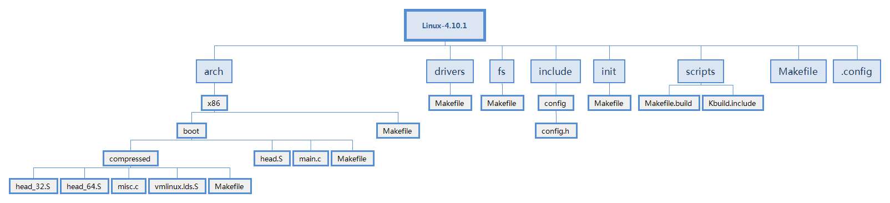
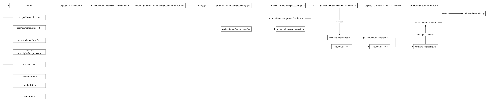

<meta http-equiv="Content-Type" content="text/html; charset=utf-8">

#Compile#
Author: Dalink

## 一、编译的输入与输出 ##

### 1、源文件 ###
Linux支持X86、PowerPC、ARM等各个硬件平台，它的源码分层组织。平台相关的代码则在arch目录下，其它代码大多与平台无关。arch下的各个文件夹代表了各个硬件平台。我们这里主要分析x86平台实现。

需要注意的是，arch/x86/boot下有个head.S文件，而arch/x86/boot下有head_32.S和head_64.S文件，它们的命名较为相识，读者需要注意加以区分。读者还应该注意到几乎每个目录下都会有一个Makefile文件，而scripts目录又有大量的“脚本”文件，这些Makefile文件和“脚本”文件构成了kernel的编译框架。

### 2、产出 ###

#### menuconfig ####

执行`make menuconfig`在跟目录下生成一个配置文件`.config`。

#### bzImage ####

bzImage是Linux的编译结果之一，它是一个可引导的文件，它的前部由ELF格式的引导程序组成，后部分为内核核心压缩得到。接下来主要探讨从源码到生成这个文件的过程。

#### modules ####

`make modules`命令用来构建模块。你也可以执行`make all`同时构建bzImage和modules。

#### install ####

`make install`命令将编译结果安装到系统。它通过执行arch/x86/boot/install.sh用来实现安装功能。

#### 生成文档 ####

`make pdfdocs`用来生成目录。

#### help ####

`make help` 用来查看帮助。

### 3、Makefile内置函数 ###

> substr

	#把字符串<text>中的<from>替换成<to>
	$(substr <from>,<to>,<text>)

> strip

	#去掉<text>字符串中开头和结尾的空字符
	$(substr <from>,<to>,<text>)

> patsubst

	#把<src>中符合<from>的替换成<to>
	$(patsubst <from>,<to>,<src>)

> filter

	#过滤<src>中不符合<pattern>
	$(filter <pattern>,<src>)

> filter-out

	#过滤<src>中符合<pattern>
	$(filter-out <pattern>,<src>)

> wildcard

	#寻找当前目录下符合filter条件的变量
	$(wildcard <filter>)

> dir

	#过滤<src>中的非目录
	$(dir <src>)

> 9、notdir

	#过滤<src>中的目录
	$(notdir <src>)

> 10、basename

	#取<src>中点号之前的名字（包含路径）
	$(basename <src>)

# 二、编译文件结构分析 #

### 1、Makefile分析 ###

主Makefile的开头定义定义了目标版本。这里定义的版本为4.10.1。教程中几乎所有的代码第一行都会有一个形如`<file> : <line>`格式的指示，它指明接下来的代码位于`file`文件`line`行。

	#Makefile ： 1
    VERSION = 4
	PATCHLEVEL = 10
	SUBLEVEL = 1
	EXTRAVERSION =
	NAME = Fearless Coyote

69~82行从命令行中读取V参数，该参数将会决定编译过程是否输出编译指令，用户通过在指令中添加V参数以实现详细结果的输出，例如`make -V=1 all`。origin是Makefile内建函数，该函数用来获取一个变量的来源。第一张，已经对这些函数做一个统一的整理，当然你返回查看它们的用法。这里，读取V变量是否是命令行参数设置的，如果是的就设置KBUILD_VERBOSE为1，quiet和Q为空。command前面带有@表示不打印command，静默执行，这类Makefile知识读者可以在网上阅读相关教程。
	
	#Makefile ： 69
	ifeq ("$(origin V)", "command line")
  		KBUILD_VERBOSE = $(V)
	endif
	ifndef KBUILD_VERBOSE
  		KBUILD_VERBOSE = 0
	endif

	ifeq ($(KBUILD_VERBOSE),1)
  		quiet =
  		Q =
	else
  		quiet=quiet_
 	 	Q = @
	endif

97行，`export quiet Q KBUILD_VERBOSE`将会把这些变量导出。被导出的变量将会传递给Makefile子命令。

186~192行， SUBDIRS变量保存了外部模块的编译目录，例如，当你开发一个设备驱动的时候，你的工作目录并不在Linux源代码目录下，那么你可以通过这个设置这个变量，用以实现关联编译。默认情况下，SUBDIRS变量未定义。 你也可以通过为Make命令添加-M参数指定这个目录。这两种方式指定的变量最终会汇总到KBUILD_EXTMOD变量。当然我们没有设置这些参数和变量，该变量也是为空。

	# Makefile ： 186
	ifdef SUBDIRS
	  KBUILD_EXTMOD ?= $(SUBDIRS)
	endif

	ifeq ("$(origin M)", "command line")
	  KBUILD_EXTMOD := $(M)
	endif

228~234行用以获取当前的硬件平台。

	#Makefile ： 228
	SUBARCH := $(shell uname -m | sed -e s/i.86/x86/ -e s/x86_64/x86/ \
					  -e s/sun4u/sparc64/ \
					  -e s/arm.*/arm/ -e s/sa110/arm/ \
					  -e s/s390x/s390/ -e s/parisc64/parisc/ \
					  -e s/ppc.*/powerpc/ -e s/mips.*/mips/ \
					  -e s/sh[234].*/sh/ -e s/aarch64.*/arm64/ )

344行，主Makefile导入scripts/Kbuild.include文件。该文件内置了大量的自定义变量，这些变量对随后的编译过程非常关键。比如`if_changed`就位于该文件。

	#Makefile ： 344
	include scripts/Kbuild.include

539行，首页将arch/x86/Makefile导入该文件中。也就是说arch/x86/Makefile的执行并不是以`make -f或-c的方式执行`，读者需要注意这一点。

	#Makefile ： 539
	include arch/$(SRCARCH)/Makefile

### 2、配置文件的导入 ###

294行，`KCONFIG_CONFIG	?= .config`，定义了KCONFIG_CONFIG变量指向.config配置文件。587~588行，表达了从.config配置文件到旧版配置文件的生成过程。命令展开后为`make -f Makefile silentoldconfig`，开始构建silentoldconfig目标。

	#Makefile ： 294
	include/config/%.conf: $(KCONFIG_CONFIG) include/config/auto.conf.cmd
		$(Q)$(MAKE) -f $(srctree)/Makefile silentoldconfig

### 3、scripts/Kbuild.include分析 ###

180定义了build变量，这个变量十分重要，构成了整个内核编译的骨架。使用形如`$(Q)$(MAKE) $(build)=dir target`的命令将会展开为`make -f scripts/Makefile.build obj=dir target`。make命令将会去处理scripts/Makefile.build文件，传入obj参数为dir，指定目标target。

	#scripts/Kbuild.include ： 180
	build := -f $(srctree)/scripts/Makefile.build obj

此时又引入了另外一个十分重要的文件，scripts/Makefile.build，稍后会对其分析。

Kbuild.include定义了大量的扩展函数。
##### if_changed #####
any-prereq代表所有比target新的prerequisites，同时过滤PHONY目标。如果存在依赖比目标新的话就会执行`cmd_(第一个参数)`命令。同时把执行命令写入到 $(dot-target).cmd文件。

	@set -e;
	$(echo-cmd) $(cmd_$(1));
	printf '%s\n' 'cmd_$@ := $(make-cmd)' > $(dot-target).cmd`

	#Kbuild.include : 254
	any-prereq = $(filter-out $(PHONY),$?) $(filter-out $(PHONY) $(wildcard $^),$^)

	# Execute command if command has changed or prerequisite(s) are updated.
	#
	if_changed = $(if $(strip $(any-prereq) $(arg-check)),                       \
		@set -e;                                                             \
		$(echo-cmd) $(cmd_$(1));                                             \
		printf '%s\n' 'cmd_$@ := $(make-cmd)' > $(dot-target).cmd, @:)

if_changed_rule也是用来检验规则。如果依赖比目标新，则执行$(rule_(第一个参数))命令。

	if_changed_rule = $(if $(strip $(any-prereq) $(arg-check) ),                 \
	@set -e;                                                             \
	$(rule_$(1)), @:)

### 4、scripts/Makefile.build分析 ###

5行，`src := $(obj)`，将obj赋值给src，src代表目标编译目录。

36行，该文件同样导入scripts/Kbuild.include文件。

	#scripts/Makefile.build ： 36
	include scripts/Kbuild.include

41~44行，获取目标目录下的Makefile文件（或Kbuild文件），然后将该文件导入。也就是说，make的执行范围为scripts/Makefile.build、scripts/Makefile.build和目标目录下的Makefile文件。

	#scripts/Makefile.build ： 41
	kbuild-dir := $(if $(filter /%,$(src)),$(src),$(srctree)/$(src))
	kbuild-file := $(if $(wildcard $(kbuild-dir)/Kbuild),$(kbuild-dir)/Kbuild,$(kbuild-dir)/Makefile)
	include $(kbuild-file)

293~295行，指定了C源代码到目标文件的编译。下面还有一些其他类型的编译过程，比如汇编的编译，链接等。编译的“核心步骤”被层层包装设计，竟然缩在这个“角落”。

	#scripts/Makefile.build ： 293
	$(obj)/%.o: $(src)/%.c $(recordmcount_source) $(objtool_obj) FORCE
		$(call cmd,force_checksrc)
		$(call if_changed_rule,cc_o_c)

394~395行，指定了S源代码到目标文件的编译。

	#scripts/Makefile.build ： 394
	$(obj)/%.o: $(src)/%.S $(objtool_obj) FORCE
		$(call if_changed_rule,as_o_S)

## 三、构建过程 ##

### 1、目标依赖分析 ###

用户执行`make all`命令开始编译。

all目标必然定义于主Makefile文件。前面已经知道，arch/x86/Makefile被include到主Makefile中，所以目标的依赖需要同时搜索这两个文件。搜索两个Makefile文件中可以发现all的两个依赖分别是vmlinux、modules和bzImage。
	
	#Makefile : 621
	all: vmlinux

	#Makefile : 1186
	all: modules

	#arch/x86/Makefile : 236
	all: bzImage

vmlinux依赖四个目标，其中FORCE为空伪目标，读者可以查看源代码自行分析。其依赖vmlinux_prereq和$(vmlinux-deps)，vmlinux_prereq也依赖$(vmlinux-deps)。

	#Makefile : 945
	vmlinux_prereq: $(vmlinux-deps) FORCE
	ifdef CONFIG_HEADERS_CHECK
		$(Q)$(MAKE) -f $(srctree)/Makefile headers_check
	endif
	ifdef CONFIG_GDB_SCRIPTS
		$(Q)ln -fsn `cd $(srctree) && /bin/pwd`/scripts/gdb/vmlinux-gdb.py
	endif
	ifdef CONFIG_TRIM_UNUSED_KSYMS
		$(Q)$(CONFIG_SHELL) $(srctree)/scripts/adjust_autoksyms.sh \
		  "$(MAKE) -f $(srctree)/Makefile vmlinux"
	endif

	#Makefile : 968
	vmlinux: scripts/link-vmlinux.sh vmlinux_prereq $(vmlinux-deps) FORCE
		+$(call if_changed,link-vmlinux)

可以画出依赖关系：

	vmlinux——————→vmlinux_prereq—————→$(vmlinux-deps)
	   |___________________________________↑

vmlinux_prereq展开为

- arch/x86/kernel/head_64.o———————————————————↘head-y
- arch/x86/kernel/head64.o
- arch/x86/kernel/ebda.o
- arch/x86/kernel/platform-quirks.o
- init/built-in.o—————————————————————————————↘init-y
- arch/x86/built-in.o—————————————————————————↘core-y
- usr/built-in.o
- kernel/built-in.o
- certs/built-in.o
- mm/built-in.o
- fs/built-in.o
- ipc/built-in.o
- security/built-in.o
- crypto/built-in.o
- block/built-in.o
- lib/lib.a———————————————————————————————————↘lib-y
- arch/x86/lib/lib.a
- lib/built-in.o
- arch/x86/lib/built-in.o
- drivers/built-in.o——————————————————————————↘drivers-y
- sound/built-in.o
- firmware/built-in.o
- net/built-in.o——————————————————————————————↘net-y

读者可以根据上面的列表对照源代码目录，查看这些目标的的覆盖范围。

	#arch/x86/Makefile : 202
	head-y := arch/x86/kernel/head_$(BITS).o
	head-y += arch/x86/kernel/head$(BITS).o
	head-y += arch/x86/kernel/ebda.o
	head-y += arch/x86/kernel/platform-quirks.o	

	libs-y  += arch/x86/lib/
	
	# See arch/x86/Kbuild for content of core part of the kernel
	core-y += arch/x86/

	#Makefile : 563
	init-y		:= init/
	drivers-y	:= drivers/ sound/ firmware/
	net-y		:= net/
	libs-y		:= lib/
	core-y		:= usr/
	virt-y		:= virt/

	#Makefile : 913
	core-y		+= kernel/ certs/ mm/ fs/ ipc/ security/ crypto/ block/

	#Makefile : 922
	init-y		:= $(patsubst %/, %/built-in.o, $(init-y))
	core-y		:= $(patsubst %/, %/built-in.o, $(core-y))
	drivers-y	:= $(patsubst %/, %/built-in.o, $(drivers-y))
	net-y		:= $(patsubst %/, %/built-in.o, $(net-y))
	libs-y1		:= $(patsubst %/, %/lib.a, $(libs-y))
	libs-y2		:= $(patsubst %/, %/built-in.o, $(libs-y))
	libs-y		:= $(libs-y1) $(libs-y2)
	virt-y		:= $(patsubst %/, %/built-in.o, $(virt-y))

	#Makefile : 932
	export KBUILD_VMLINUX_INIT := $(head-y) $(init-y)
	export KBUILD_VMLINUX_MAIN := $(core-y) $(libs-y) $(drivers-y) $(net-y) $(virt-y)

	#sMakefile : 939
	vmlinux-deps := $(KBUILD_LDS) $(KBUILD_VMLINUX_INIT) $(KBUILD_VMLINUX_MAIN)

下面查看bzImage的依赖。

bzImage依赖vmlinux，接下来执行`make `开始为boot目录构建目标KBUILD_IMAGE。KBUILD_IMAGE变量值为$(boot)/bzImage，arch/x86/Makefile 239行。

	#arch/x86/Makefile : 240
	bzImage: vmlinux
	ifeq ($(CONFIG_X86_DECODER_SELFTEST),y)
		$(Q)$(MAKE) $(build)=arch/x86/tools posttest
	endif
		$(Q)$(MAKE) $(build)=$(boot) $(KBUILD_IMAGE)
		$(Q)mkdir -p $(objtree)/arch/$(UTS_MACHINE)/boot
		$(Q)ln -fsn ../../x86/boot/bzImage $(objtree)/arch/$(UTS_MACHINE)/boot/$@

可以画出依赖关系：

	all—————————————>vmlinux——————>vmlinux_prereq
	  | 				↑
	  |					|
	  |—————bzImage————→|
	  |—————————————————————————————————modules

arch/x86/boot/bzImage依赖arch/x86/boot/setup.bin arch/x86/boot/vmlinux.bin arch/x86/boot/tools/build。可以看出bzImage由两部分组成，分别是setup.bin和vmlinux.bin，最后通过image命令组合在一起。这里的分析要分成两路。首先分析vmlinux.bin的构建。可以看到，使用build程序传入setup.bin、vmlinux、bin、zoffset.h、bzImage参数用以生成目标。读者可以分析build源码，查看它的详细生成过程。

	#arch/x86/boot/Makefile : 75
	quiet_cmd_image = BUILD   $@
	cmd_image = $(obj)/tools/build $(obj)/setup.bin $(obj)/vmlinux.bin \
			       $(obj)/zoffset.h $@

	$(obj)/bzImage: $(obj)/setup.bin $(obj)/vmlinux.bin $(obj)/tools/build FORCE
		$(call if_changed,image)
		@echo 'Kernel: $@ is ready' ' (#'`cat .version`')'

生成的arch/x86/boot/zoffset.h文件内容：

	#define

arch/x86/boot/vmlinux.bin依赖arch/x86/boot/compressed/vmlinux，arch/x86/boot/compressed/vmlinux为一个elf文件，利用objcopy命令删去.note、.comment、可重定位信息表和符号信息表（-S参数）。
	
	#arch/x86/boot/Makefile : 83
	OBJCOPYFLAGS_vmlinux.bin := -O binary -R .note -R .comment -S
	$(obj)/vmlinux.bin: $(obj)/compressed/vmlinux FORCE
		$(call if_changed,objcopy)

arch/x86/boot/compressed/vmlinux依赖伪目标,所以它的的command一定会执行。make处理arch/x86/boot/compressed目录的arch/x86/boot/compressed/vmlinux目标。Makefile中，$@代表这一关系的目标。

	#arch/x86/boot/Makefile : 110
	$(obj)/compressed/vmlinux: FORCE
		$(Q)$(MAKE) $(build)=$(obj)/compressed $@

在arch/x86/boot/compressed/Makefile，arch/x86/boot/compressed/vmlinux依赖arch/x86/boot/compressed/vmlinux.lds、arch/x86/boot/compressed/head_64.o、arch/x86/boot/compressed/misc.o 、 arch/x86/boot/compressed/string.o、 arch/x86/boot/compressed/cmdline.o arch/x86/boot/compressed/error.o 、 arch/x86/boot/compressed/piggy.o 和 arch/x86/boot/compressed/cpuflags.o。注意下面的文件与上一条的区别，它们不再同一个Makefile文件中，下面的Makefile文件（即）是由上一个Makefile驱动的，参考前面一段话的描述。

	#arch/x86/boot/compressed/Makefile : 104
	$(obj)/vmlinux: $(vmlinux-objs-y) FORCE
	$(call if_changed,check_data_rel)
	$(call if_changed,ld)

piggy.o 依赖 piggy.S。而piggy.S这个文件又是动态生成的，它依赖$(obj)/vmlinux.bin.xz。$(obj)/vmlinux.bin.xz又依赖$(obj)/vmlinux.bin。$(obj)/vmlinux.bin又依赖于vmlinux。读者可以分析文件。

我们的环境下，`CONFIG_KERNEL_XZ=y`，可以推导`suffix-y=xz`。所以piggy.S依赖vmlinux.bin.xz和mkpiggy。变量vmlinux.bin.all-y为$(obj)/vmlinux.bin。

`objc -R .comment -S`处理vmlinux，生成$(obj)/vmlinux.bin文件。xzkern命令将$(obj)/vmlinux.bin处理成$(obj)/vmlinux.bin.xz。mkpiggy程序根据$(obj)/vmlinux.bin.xz得到piggy.S。然后ld把这些目标文件链接输出为arch/x86/boot/compressed/vmlinux。

	#arch/x86/boot/compressed/Makefile : 108
	OBJCOPYFLAGS_vmlinux.bin :=  -R .comment -S
	$(obj)/vmlinux.bin: vmlinux FORCE
		$(call if_changed,objcopy)

	#arch/x86/boot/compressed/Makefile : 143
	quiet_cmd_mkpiggy = MKPIGGY $@
      cmd_mkpiggy = $(obj)/mkpiggy $< > $@ || ( rm -f $@ ; false )

	targets += piggy.S
	$(obj)/piggy.S: $(obj)/vmlinux.bin.$(suffix-y) $(obj)/mkpiggy FORCE
		$(call if_changed,mkpiggy)

	#arch/x86/boot/compressed/Makefile : 129
	$(obj)/vmlinux.bin.xz: $(vmlinux.bin.all-y) FORCE
		$(call if_changed,xzkern)

piggy.S在编译的时候会把arch/x86/boot/compressed/vmlinux.bin.xz读入到自己的一个名为.rodata..compressed的section中，查看piggy.S文件可知。

笔者的piggy.S内容为：

	.section ".rodata..compressed","a",@progbits
	.globl z_input_len
	z_input_len = 3866132
	.globl z_output_len
	z_output_len = 19470760
	.globl input_data, input_data_end
	input_data:
	.incbin "arch/x86/boot/compressed/vmlinux.bin.xz"
	input_data_end:

继续分析可知vmlinux.bin.xz依赖arch/x86/boot/compressed/vmlinux.bin，arch/x86/boot/compressed/vmlinux.bin依赖vmlinux。画出依赖关系图：

	arch/x86/boot/bzImage————→arch/x86/boot/vmlinux.bin—————→arch/x86/boot/compressed/vmlinux————→
			|			      																	 |
			|				   ←————————arch/x86/boot/compressed/vmlinux.bin.xz←—————piggy.S←————↓
			↓			       ↓
	arch/x86/boot/setup.bin	   —————————→arch/x86/boot/compressed/vmlinux.bin—————————————→vmlinux

文件由此生成。我们回到bzImage的依赖，刚才分析到bzImage的另一个依赖为setup.bin。接下来分析setup.bin的构建。

setup.bin依赖setup.elf,

setup.elf依赖$(src)/setup.ld、arch/x86/boot/*.o。需要注意的是，head.o依赖zoffset.h，zoffset.h又是由vmlinux动态生成的。

	#arch/x86/boot/Makefile : 99
	quiet_cmd_zoffset = ZOFFSET $@
	      cmd_zoffset = $(NM) $< | sed -n $(sed-zoffset) > $@
	
	targets += zoffset.h
	$(obj)/zoffset.h: $(obj)/compressed/vmlinux FORCE
		$(call if_changed,zoffset)
	
	
	AFLAGS_header.o += -I$(objtree)/$(obj)
	$(obj)/header.o: $(obj)/zoffset.h
	
	LDFLAGS_setup.elf	:= -T
	$(obj)/setup.elf: $(src)/setup.ld $(SETUP_OBJS) FORCE
		$(call if_changed,ld)
	
	OBJCOPYFLAGS_setup.bin	:= -O binary
	$(obj)/setup.bin: $(obj)/setup.elf FORCE
		$(call if_changed,objcopy)

笔者得到的zoffset.h的内容为

	#define ZO__ehead 0x00000000000003b4
	#define ZO__end 0x00000000003d4000
	#define ZO__text 0x00000000003b01d0
	#define ZO_efi32_stub_entry 0x0000000000000190
	#define ZO_efi64_stub_entry 0x0000000000000390
	#define ZO_efi_pe_entry 0x0000000000000210
	#define ZO_input_data 0x00000000000003b4
	#define ZO_startup_32 0x0000000000000000
	#define ZO_startup_64 0x0000000000000200
	#define ZO_z_input_len 0x00000000003afe14
	#define ZO_z_output_len 0x00000000012919a8

可以画出setup.bin的构建流程图：

	arch/x86/boot/bzImage———————→arch/x86/boot/setup.bin—————→arch/x86/boot/setup.elf——————→
			|																			   |
			|			          ←————————arch/x86/boot/header.o←—————$(SETUP_OBJS)←——————↓
			↓			          ↓
	arch/x86/boot/vmlinux.bin	  —→arch/x86/boot/zoffset.h—→arch/x86/boot/compressed/vmlinux

### 2、编译流程图解 ###

